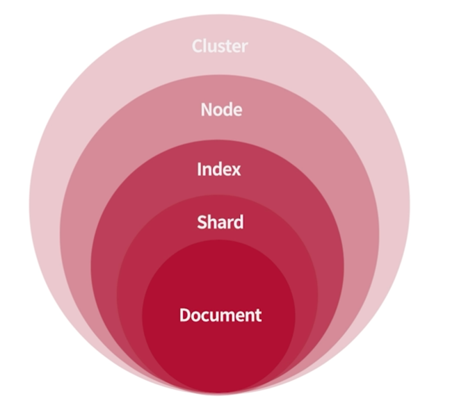

### Cluster

- cluster.name 설정이 가장 중요
- Default : elasticsearch
- cluster 구성 시 node 역할에 따른 구성 필수
- master node 에 대한 quorum 구성 필수
- split brain 에 대한 오류를 예방 할 수 있기 때문에
- 클러스터 구성시 중요한 설정

```
cluster.name
discovery.type (싱글 노드)
discovery.seed_hots (클러스터링)
cluster.initial_master_nodes
```

### Node

- Elasticsearch 인스턴스가 시작 될 때 마다 실행
- 노드들의 모음이 Cluster
- 단일 노드로도 실행가능(= 단일노드 클러스터)
- 설정 기본 : node.name 과 node.roles
- 노드의 이름을 지정하고 역할을 정의 해서 용도와 목적에 따라 운영

#### 가장 많이 사용하는 노드 종류

- master
    - 개별 노드와 인덱스에 대한 상태, 메타 정보 관리
    - 특성에 맞춰 CPU, MEM에 대한 시스템 자원이 충분해야함.
- data 노드
    - 색인한 문서의 shard 가 저장되어 있는 노드
    - 문서에 대한 CRUD 와 검색, 집계와 같은 데이터 작업 처리
    - **Disk I/O**, CPU, MEM 등에 대한 자원이 충분해야함.
- coordinating 노드
    - 검색 요청이나 대량 색인 요청에 대한 라우팅 역할
    - (불필요한 요청을 master 나 data 노드에서 처리를 할 필요가 없고 부하를 생성할 필요가 없기 때문)
    - master 노드와 유사하게 CPU, MEM 대한 자원이 충분 하면 좋음

### Index

- 분산된 Shard 에 저장된 문서들의 논리적 집합
- 물리적으로는 Shard 하나가 하나의 독립된 Index 로 동작하며, 루씬에서 보면 indexWriter 가 Shard 당 하나씩 생성
- Primary shard 와 Replica shard 로 구성 되며, Data Node 에만 위치
- 데이터 유형에 따라 Hot, Warm, Cold, Frozen 과 같이 분리해서
- ILM 을 이용해서 용량에 따른 rolling 도 가능
- Lucene 기준의 Index 를 Elasticsearch 에서는 Shard 라고함.

### Shard

- 물리적인 데이터가 저장 되어 있는 단위
- Indexing 요청이 있을 때 분산된 노드에 위치한 shard 로 문서를 색인
- Index 의 shard 는 특정 node 의 역할에 맞춰 배치 가능
- health status 상태는 shard 상태를 가지고 정의를 내림
    - green : 모든 샤드 정상
    - yellow : 서비스 동작 O (primary shard 는 정상적으로 할당이 되었으나 replica shard 중 일부라도 할당이 되지 않았을 경우 상태)
    - red : 서비스 정상적 동작 X (Primary shard 중 하나 이상이 할당 되지 않았을 경우)

#### primary shard

- 색인 요청이 들어오면 가장 먼저 생성해서 문서를 저장 하게 되는 shard (=원본 데이터)
- 이를 기반으로 데이터를 복제 하여 활용
- 색인 성능을 개선 하기 위한 포인트로 활용
- Data 노드의 크기와 CPU 코어 크기를 고려해서 primary shard 크기를 설정

#### Replica Shard

- Primary shard 를 기준으로 복제 하는 shard
- 검색 성능을 개선 하기 위한 용도로 활용
- 중간에 데이터를 동적으로 변경가능하다.


